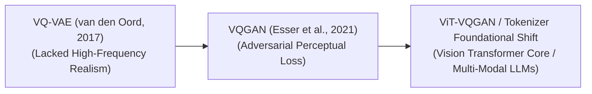

# Awesome-VQGAN
## Vector Quantized Generative Adversarial Networks (VQGAN): Evolution, Variants, & Applications

A Vector Quantized Generative Adversarial Network (VQGAN) is a foundational deep learning architecture that merges the structural properties of Vector Quantized Variational Autoencoders (VQ-VAE) with the perceptual fidelity of Generative Adversarial Networks (GANs). Introduced by Esser et al. in 2021 ("Taming Transformers for High-Resolution Image Synthesis"), VQGAN bridges the gap between convolutional neural networks and transformer architectures. By quantizing continuous visual features into a discrete set of codebook vectors, VQGAN compresses high-resolution images into a dense sequence of discrete visual tokens. This serialization enables standard autoregressive Transformers to model complex visual layouts, high-frequency textures, and long-range structural dependencies with linear token efficiency.

---

## 1. The Chronological Evolution

The technical progression of discrete visual tokenization has transitioned from raw pixel autoencoders to adversarial codebooks, moving toward unified token spaces for modern multi-modal foundation models.

| Era / Model | Core Description & Details | First Used (Year) | Reference Paper |
| :--- | :--- | :--- | :--- |
| [**The Discrete Foundation Era (VQ-VAE, 2017)**](docs/discrete_foundation_era.md) | Formally introduced vector quantization in deep generative models by replacing traditional continuous latent spaces with a discrete codebook matrix.    *Limitation:* Trained purely using pixel-level reconstruction losses (like Mean Squared Error), causing blurry, averaged images lacking fine, high-frequency textural details (e.g., individual hairs or complex patterns). | 2017 | [Neural Discrete Representation Learning](https://arxiv.org/abs/1711.00937) |
| [**The Adversarial Perceptual Revolution (VQGAN, 2021)**](docs/adversarial_perceptual_revolution.md) | Stabilized and crisped up discrete codebook extraction by pairing the VQ-VAE structure with a patch-based **Discriminator network** and a pre-trained **Perceptual Loss function** (e.g., LPIPS).    *Significance:* Prioritized structural realism over exact pixel-by-pixel matching to deliver sharp, photorealistic downscaled token maps, making it the default visual codebook generator for the first generation of large-scale text-to-image systems (like early CLIP-guided generators and Parti). | 2021 | [Taming Transformers for High-Resolution Image Synthesis](https://arxiv.org/abs/2012.09841) |
| **The Vision Transformer Core & Unified Token Era (~2023–Present)** | Swaps baseline convolutional encoder/decoder layers with high-capacity Vision Transformer blocks.    *Significance:* Eliminates convolutional inductive biases, aligning the image tokenizer's inner geometry perfectly with large language model backbones. This allows text and image patches to be tokenized and processed natively inside the exact same autoregressive transformer workspace. | 2021 / 2024 | [Vector-Quantized Image Modeling with Improved VQGAN](https://arxiv.org/abs/2110.04627) (ViT-VQGAN) / [Chameleon: Mixed-Modal Early-Fusion Foundation Models](https://arxiv.org/abs/2405.09818) |

---

## 2. Core Functional & Architectural Variants

VQGAN systems deploy distinct mathematical and codebook strategies to optimize codebook utilization, combat index collapse, and reduce quantization errors.

| Variant | Core Description & Details | First Used (Year) | Reference Paper |
| :--- | :--- | :--- | :--- |
| **Convolutional VQGAN (The Baseline)** | Uses a deep Convolutional Neural Network (CNN) as the encoder to downsample a $256 \times 256$ image into a $16 \times 16$ grid of latent vectors. Each vector is mapped to its nearest neighbor inside a discrete codebook matrix before a CNN decoder reconstructs the image. | 2021 | [Taming Transformers for High-Resolution Image Synthesis](https://arxiv.org/abs/2012.09841) |
| **ViT-VQGAN (Transformer-Based)** | Replaces the CNN backbone entirely with a Vision Transformer (ViT). Images are sliced into standard patches, passed through self-attention blocks, and mapped to the codebook.    *Pros:* Offers vastly superior scaling laws, cleaner text-image token alignment, and sharper edge reconstructions. | 2021 | [Vector-Quantized Image Modeling with Improved VQGAN](https://arxiv.org/abs/2110.04627) |
| **Factorized / Quantized Residual Codebooks (RQ-VAE / SoundStream Style)** | Implements a recursive, multi-stage quantization loop instead of mapping a latent vector to a single codebook index. The first stage maps the dominant feature, and subsequent stages quantize the remaining mathematical residual.    *Pros:* Dramatically multiplies the effective vocabulary resolution without blowing up the physical codebook memory footprint. | 2021 / 2022 | [SoundStream: An End-to-End Neural Audio Codec](https://arxiv.org/abs/2107.03312) / [Autoregressive Image Generation using Residual Quantization](https://arxiv.org/abs/2203.01941) |

---

## 3. Training Dynamics & Codebook Management

Because discrete argmax quantization operations are inherently non-differentiable, VQGAN architectures rely on specialized optimization hacks to route gradients cleanly during training.

| Strategy / Component | Core Description & Details | First Used (Year) | Reference Paper |
| :--- | :--- | :--- | :--- |
| **Straight-Through Estimator (STE)** | Solves the zero-gradient calculation barrier of discrete quantization. During the forward pass, the vector is rigidly snapped to the nearest discrete codebook index. During the backward pass, the codebook operation is mathematically ignored; gradients bypass the discretization step, flowing straight from the decoder back into the encoder layers unaltered. | 2013 | [Estimating or Propagating Gradients Through Stochastic Neurons for Conditional Computation](https://arxiv.org/abs/1308.3432) |
| **Codebook Commitment Loss** | Appends an explicit optimization penalty to the global loss function. This regularizer forces the encoder's output space to sit closely to the codebook coordinates, preventing the latent vectors from drifting too far away from valid discrete index zones. | 2017 | [Neural Discrete Representation Learning](https://arxiv.org/abs/1711.00937) |
| **Vector Quantization Decay & Re-initialization** | Tracks codebook utilization to prevent **Codebook Collapse** (dead codes), where a tiny fraction of codebook vectors are repeatedly selected while the remaining 90% of indices receive zero gradients and become permanently deactivated.    *Mitigation:* Implementing K-Means / batch Re-initialization (restarting unused codes to active encoder features). | 2020 | [Jukebox: A Generative Model for Music](https://arxiv.org/abs/2005.00341) |

---

## 4. Production Engineering Challenges & Adaptations

Deploying VQGAN tokenizers into high-throughput generative AI infrastructure introduces unique computational bottlenecks.

| Challenge | Core Description & Details | First Used (Year) | Reference Paper |
| :--- | :--- | :--- | :--- |
| **The Spatial Sequence Context Window Penalty** | Processing a standard $256 \times 256$ image through a $16 \times 16$ VQGAN grid yields exactly 256 visual tokens. When scaling up generation tasks to process massive $1024 \times 1024$ megapixel outputs, the visual token sequence swells to over 4,096 tokens, saturating the KV cache memory and choking subsequent autoregressive language model layers.    *Mitigation:* Shifting away from pure autoregressive generation toward **Diffusion Transformer (DiT) backbones**, which handle continuous latent representations natively without requiring discrete codebook serialization steps. | 2022 | [Scalable Diffusion Models with Transformers](https://arxiv.org/abs/2212.09748) |
| **The Tiling and Boundary Artifact Glitch** | When reconstructing compressed images via early convolutional VQGAN decoders, the boundaries of the discrete feature patches can experience localized grid misalignment, producing visible, geometric tile lines across flat color zones (like skies or skin tones).    *Mitigation:* Swapping convolutional decoders with **ViT-based architectures paired with Masked Language Modeling (MLM) losses**, ensuring global attention parameters smooth out edge transitions seamlessly. | 2022 | [MaskGIT: Masked Generative Image Transformer](https://arxiv.org/abs/2202.04200) |

---

## 5. Frontier Real-World AI Applications

| Application | Core Description & Details | First Used (Year) | Reference Paper |
| :--- | :--- | :--- | :--- |
| **Autoregressive Multimodal LLM Tokenization Layers** | Serves as the frontend visual tokenizer for omni-directional multi-modal foundation models. VQGAN serializes physical camera frames into discrete numerical token sequences, allowing unified transformers to read, process, and generate text alongside interlaced native graphics seamlessly. | 2024 | [Chameleon: Mixed-Modal Early-Fusion Foundation Models](https://arxiv.org/abs/2405.09818) |
| **High-Yield Medical Image Compression & Transmission** | Compresses massive, ultra-high-resolution clinical diagnostic charts (such as MRI scans, 3D CT volumes, or pathology slides). VQGAN compresses file sizes by over $95\%$ while preserving critical anatomical structures and tumor texturing boundaries via perceptual loss verification, permitting low-bandwidth data transfers between hospitals safely. | 2023 | [Extreme Image Compression using Fine-tuned VQGAN Models](https://arxiv.org/abs/2307.03929) |
| **Spatio-Temporal Codebook Generation for Video LLMs** | Powers video comprehension architectures. Video frames are chunked into continuous Spacetime Codebook Cubes (3D VQGAN). The tokenizer processes short temporal clips into discrete sequences, allowing down-line models to reason through hours of continuous surveillance or drone tracking feeds efficiently. | 2022 | [Long Video Generation with Time-Agnostic VQGAN and Time-Sensitive Transformer](https://arxiv.org/abs/2204.03638) |

